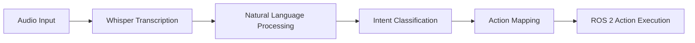

# Voice Commands and Language-to-Action Mapping

## Voice Command Processing with OpenAI Whisper

OpenAI Whisper has emerged as a leading solution for speech-to-text conversion in robotics applications, offering several advantages for voice-controlled humanoid robots:

### Whisper's Capabilities
- **Multilingual Support**: Whisper can handle multiple languages without requiring separate models
- **Robustness**: Performs well in various acoustic conditions and with different accents
- **Open Source Options**: Several model sizes are available, from tiny models for edge deployment to large models for maximum accuracy
- **Context Awareness**: Can be prompted to expect specific vocabulary or domains

### Implementation Architecture
The voice processing pipeline typically follows this structure:




The diagram above shows the complete voice processing pipeline from audio input to ROS 2 action execution, highlighting the key components and data flow.

### Setting Up Whisper for Robotics
```python
import whisper
import torch

# Load model (choose appropriate size for your hardware)
model = whisper.load_model("base")  # or "small", "medium", "large"

# Transcribe audio
result = model.transcribe("audio_file.wav")
command_text = result["text"]
```

### Real-time Processing Considerations
For real-time voice command processing, consider:
- Using smaller models for faster inference
- Implementing streaming audio processing
- Adding wake word detection
- Handling background noise and audio quality issues

## Translating Natural Language into Robot Intents

The translation from natural language to robot intents involves several steps:

### Intent Classification
The system must categorize commands into actionable robot capabilities:

| Natural Language Command | Classified Intent | Parameters |
|-------------------------|-------------------|------------|
| "Move forward 2 meters" | `NAVIGATE_FORWARD` | `distance: 2.0` |
| "Pick up the red ball" | `GRASP_OBJECT` | `object_color: "red", object_type: "ball"` |
| "Turn left" | `ROTATE` | `direction: "left", angle: 90` |
| "Go to the kitchen" | `NAVIGATE_TO_LOCATION` | `location: "kitchen"` |

### Parameter Extraction
Beyond intent classification, the system must extract specific parameters:

- **Quantities**: Numbers, measurements, counts
- **Attributes**: Colors, sizes, shapes, materials
- **Locations**: Specific places, spatial relationships
- **Objects**: Types, identifiers, categories
- **Temporal aspects**: Durations, sequences, timing

### Context Resolution
Natural language often contains implicit references that require context:

- **Pronouns**: "it", "that", "the one I pointed to"
- **Spatial references**: "over there", "to the left", "on top"
- **Temporal references**: "like before", "the same way", "as usual"
- **Deixis**: Gestural or contextual references

## Mapping Language Plans to ROS 2 Actions

ROS 2 provides a standardized framework for action execution in robotics. The mapping from language intents to ROS 2 actions involves:

### Action Interface Design
Each robot capability should be exposed as a ROS 2 action with appropriate goal, result, and feedback messages:

```yaml
# Example action interface for navigation
NavigateToPose:
  goal:
    pose: geometry_msgs/PoseStamped
  result:
    outcome: int8
    message: string
  feedback:
    distance_remaining: float64
    angle_remaining: float64
```

### Intent-to-Action Mapping
The system maintains a mapping between classified intents and ROS 2 action interfaces:

```python
INTENT_ACTION_MAPPING = {
    'NAVIGATE_TO_LOCATION': {
        'action_name': '/navigate_to_pose',
        'action_type': 'nav2_msgs/action/NavigateToPose',
        'parameter_mapper': map_location_to_pose
    },
    'GRASP_OBJECT': {
        'action_name': '/manipulation/grasp',
        'action_type': 'manipulation_msgs/action/GraspObject',
        'parameter_mapper': map_object_description_to_grasp
    }
}
```

### Parameter Conversion
Language parameters must be converted to ROS 2 message formats:

```python
def map_location_to_pose(intent_params):
    # Convert location name to coordinates
    location_coords = get_location_coordinates(intent_params['location'])
    pose = PoseStamped()
    pose.header.frame_id = 'map'
    pose.pose.position.x = location_coords['x']
    pose.pose.position.y = location_coords['y']
    return pose
```

### Safety Validation
Before executing any action, the system must validate:

- **Physical feasibility**: Can the robot actually perform the action?
- **Safety constraints**: Is the action safe for the robot and environment?
- **Resource availability**: Does the robot have necessary resources?
- **Environmental conditions**: Are conditions appropriate for the action?

## Practical Implementation Patterns

### State Management
Voice-controlled robots benefit from state management to handle context:

```python
class VoiceCommandProcessor:
    def __init__(self):
        self.current_state = RobotState()
        self.conversation_context = []

    def process_command(self, text):
        # Update context with current command
        self.conversation_context.append(text)

        # Classify intent considering context
        intent = self.classify_intent_with_context(text, self.conversation_context)

        # Execute action
        return self.execute_intent(intent)
```

### Error Handling and Recovery
The system should handle various error conditions gracefully:

- **Recognition errors**: Unclear or misrecognized speech
- **Ambiguity**: Unclear references or multiple possible interpretations
- **Execution failures**: Actions that cannot be completed
- **Safety violations**: Commands that would be unsafe

### User Feedback
Provide clear feedback about command recognition and execution:

- **Acknowledgment**: Confirm receipt of command
- **Processing status**: Indicate when processing is happening
- **Execution feedback**: Report progress and completion
- **Error reporting**: Explain why commands cannot be executed

## Advanced Techniques

### Multi-turn Conversations
Complex tasks may require multiple interactions:

```python
# Example of multi-turn interaction
# User: "I want to clean the table"
# Robot: "Which table? I see the kitchen table and the dining table."
# User: "The kitchen table"
# Robot: "What would you like me to do with the items on the table?"
```

### Learning from Interaction
The system can improve over time by learning from successful and failed interactions:

- **Successful mappings**: Reinforce successful intent-to-action mappings
- **Corrections**: Learn from user corrections to improve accuracy
- **Preference learning**: Adapt to user preferences and communication styles

## Challenges and Best Practices

### Accuracy vs. Latency Trade-offs
Balance the need for accurate speech recognition with real-time responsiveness.

### Domain Adaptation
Fine-tune language understanding for specific robot capabilities and environments.

### Robustness to Noise
Implement noise reduction and audio preprocessing for reliable performance.

### Privacy Considerations
Handle voice data appropriately, especially in personal or sensitive environments.

## Practical Examples

### Example 1: Voice Command Processing Pipeline
Complete implementation of a voice command processing system:

```python
import whisper
import rospy
from std_msgs.msg import String
from geometry_msgs.msg import Pose

class VoiceCommandProcessor:
    def __init__(self):
        # Initialize Whisper model
        self.whisper_model = whisper.load_model("base")

        # Initialize ROS publishers for different action types
        self.nav_publisher = rospy.Publisher('/move_base_simple/goal', Pose, queue_size=1)
        self.cmd_publisher = rospy.Publisher('/robot_command', String, queue_size=1)

    def process_voice_command(self, audio_data):
        # Step 1: Speech-to-text with Whisper
        result = self.whisper_model.transcribe(audio_data)
        text_command = result["text"]

        # Step 2: Intent classification
        intent = self.classify_intent(text_command)

        # Step 3: Parameter extraction
        params = self.extract_parameters(text_command)

        # Step 4: Action mapping and execution
        self.execute_action(intent, params)

    def classify_intent(self, command):
        # Simple intent classification based on keywords
        if any(word in command.lower() for word in ["go to", "move to", "navigate"]):
            return "NAVIGATE"
        elif any(word in command.lower() for word in ["pick", "grasp", "take"]):
            return "GRASP"
        elif any(word in command.lower() for word in ["stop", "halt", "pause"]):
            return "STOP"
        return "UNKNOWN"

    def execute_action(self, intent, params):
        if intent == "NAVIGATE":
            target_pose = self.create_pose_from_params(params)
            self.nav_publisher.publish(target_pose)
```

### Example 2: ROS 2 Action Mapping
Mapping classified intents to ROS 2 actions:

```python
from rclpy.action import ActionClient
from nav2_msgs.action import NavigateToPose
import rclpy

class IntentMapper:
    def __init__(self):
        self.node = rclpy.create_node('intent_mapper')
        self.nav_client = ActionClient(self.node, NavigateToPose, 'navigate_to_pose')

    def map_intent_to_ros_action(self, intent, params):
        if intent.intent_type == "NAVIGATE_TO_LOCATION":
            return self.execute_navigation_action(params)
        elif intent.intent_type == "GRASP_OBJECT":
            return self.execute_manipulation_action(params)
        # Add more mappings as needed
        return False

    def execute_navigation_action(self, params):
        goal_msg = NavigateToPose.Goal()
        goal_msg.pose.header.frame_id = 'map'
        goal_msg.pose.pose.position.x = params['x']
        goal_msg.pose.pose.position.y = params['y']
        # ... set orientation, etc.

        self.nav_client.wait_for_server()
        return self.nav_client.send_goal_async(goal_msg)
```

## Troubleshooting

### Common Voice Recognition Issues

**Issue**: Whisper fails to recognize commands in noisy environments
- **Solution**: Implement noise reduction preprocessing or use Whisper's built-in robustness features
- **Alternative**: Use beamforming microphones to improve signal-to-noise ratio

**Issue**: Misrecognition of technical terms or robot-specific commands
- **Solution**: Fine-tune Whisper model on domain-specific vocabulary or use prompting techniques
- **Alternative**: Implement a post-processing correction system based on robot context

### Intent Classification Problems

**Issue**: Intent classifier frequently misclassifies similar commands
- **Solution**: Improve training data with more examples of ambiguous cases
- **Alternative**: Implement confidence thresholds and human clarification requests

**Issue**: Parameter extraction fails for complex sentence structures
- **Solution**: Use more sophisticated NLP models or rule-based parsing
- **Alternative**: Implement multiple parsing strategies with fallbacks

### Action Mapping Failures

**Issue**: Valid intents fail to map to appropriate ROS 2 actions
- **Solution**: Ensure complete mapping table between all possible intents and ROS 2 actions
- **Alternative**: Implement a default action for unmapped intents with error reporting

**Issue**: Action parameters are incorrectly formatted for ROS 2
- **Solution**: Implement parameter validation and conversion functions
- **Alternative**: Use ROS 2 action interfaces with automatic type checking

## Summary

The voice-to-action pipeline transforms natural language commands into executable robot behaviors through a series of processing steps: speech-to-text conversion, intent classification, parameter extraction, and action mapping. Success requires careful attention to both the technical implementation and the human factors involved in natural human-robot interaction.